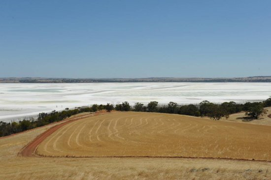
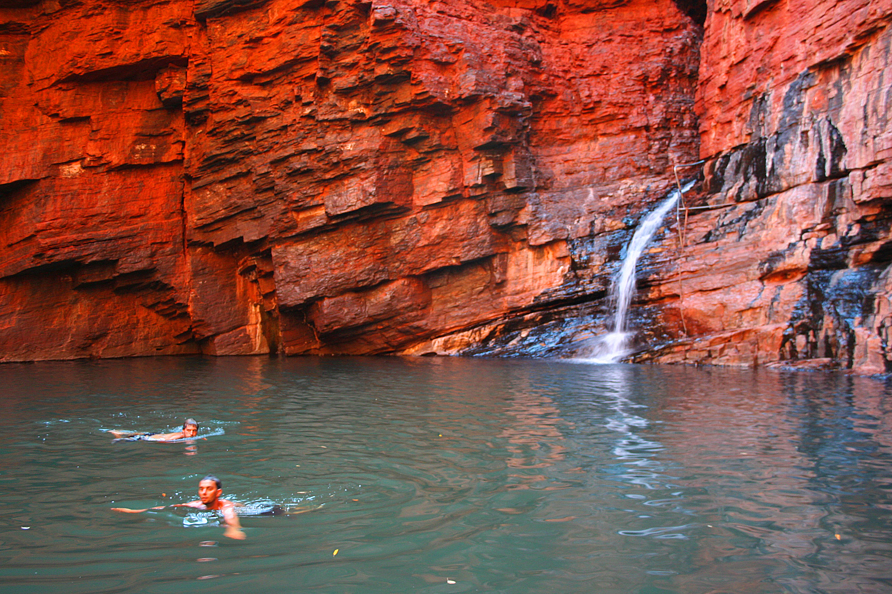
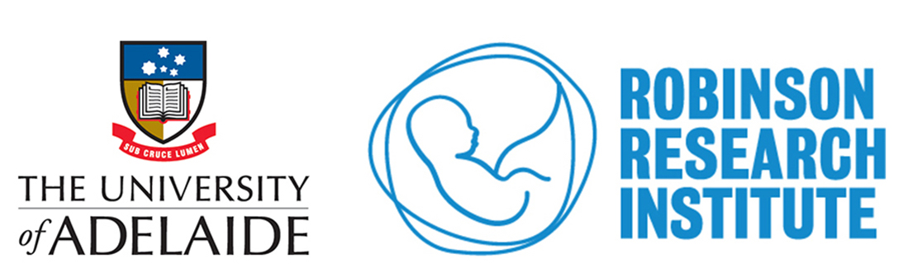
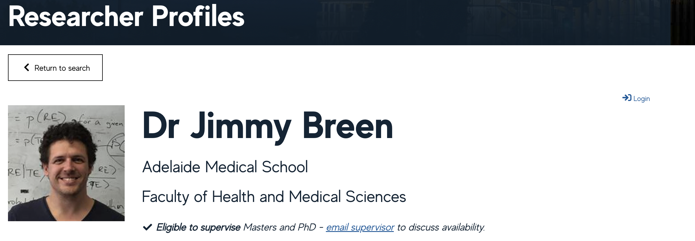
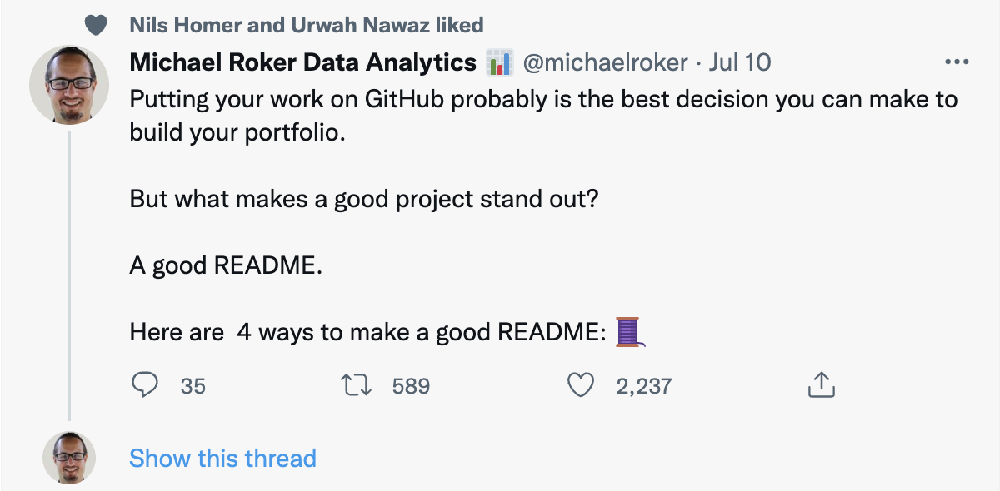
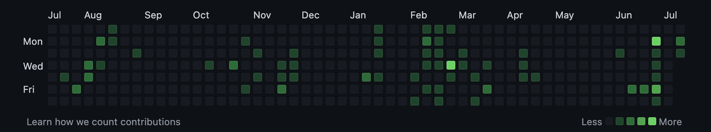

# **Developing a Precision Medicine framework for Indigenous Australians**

## Jimmy Breen 

Black Ochre Data Labs
Telethon Kids Institute & 
Australian National University 

---

# About me

- Grew up on Noongar and Banjima lands (SW Western Australia and the Pilbra)
    - Dumbleyung, Booyup Brook, Mundijong, Tom Price

  

---

# About me

- Went to High School and University in Perth
- PhD in Bioinformatics & Plant Genomics and a BSc (hons) in Molecular Biology. 
    - Both at Murdoch University

---

# Previously life'(s)

1. Postdoc at the Institute of Plant Biology, University of Zurich (2009-2012)

 

---

# Previously life'(s)

2. Next-generation Sequencing Analyst & Bioinformatics Officer (2012)
    - Australian Genome Research Facility (AGRF), Brisbane
    - Primarily early Illumina and 454 QC

3. Postdoc at ACAD in Ancient Plant DNA (2013-16)

---

# Previously life'(s)

4. Bioinformatics core-facility manager at Robinson Research Institute (University of Adelaide) & Bioinformatics Hub (2016-2018)

5. SAHMRI & Faculty of Health & Medical Sciences Bioinformatics group leader (2018-2019)

6. SAGC Bioinformatics Lead (2019-2021)

 

---

# Current life
## Black Ochre Data Labs

- Public Health & Bioinformatics group
- Based in Adelaide & Perth
- Focused on: 
    - Developing Precision Health approaches for Aboriginal and Torres Strait Islanders
    - Complex diseases that impact Indigenous Australians, including Type 2 Diabetes, Cardiovascular Disease, Chronic/Diabetic Kidney Disease

---

---

# Why am I a good person to talk to about Bioinformatics?

- I've worked across most employment areas
    - Academia
    - Medical Research Institute (MRI)
    - Industry
- I've worked across many different scientific disciplines
    - Agricultural Genomics
    - Indigenous Healthcare
    - Viticulture
    - Ancient DNA
    - Biomedical Research

---

# Why am I a good person to talk to about Bioinformatics?

- President of ABACBS
    - We have over 1,000 members across Australia
    - Various sub-committees including our student sub-committee COMBINE
- I connect with a lot of people within the industry
- Diversity of positions and roles as a Bioinformatician
- I get contacted by recruiters a lot

---

# What is a Bioinformatician?

_A bioinformatician is a specialist who combines computer science into the area of biology by analysing large data sets such as raw genomic data for clinical and research purposes_

<!-- footer: "[A career as a bioinformatician - NSW Health](https://www.health.nsw.gov.au/careers/students/Pages/careers-bioinformatician.aspx)" -->

---

# What are the different Bioinformatics roles?

- Data analyst
    - Probably has a BSc in Computer Science, Statistics or Biology
- Core-facility/consulting
    - Probably has a MSc/MPhil in Computer Science, Statistics or Biology
- Informatics/System Administration
    - Probably has a BSc in Computer Science
- DevOps
    - Probably has a BSc in Computer Science
- Software development
    - Probably has a BSc in Computer Science
- Research fellow
    - Probably has a PhD in Computer Science, Statistics or Biology

<!-- footer: "" -->

---

# What do Bioinformaticians do?

- Biological data analysis (as defined by Illumina*)
    - Primary: Analysing data straight from a machine. Usually done by a machine or ancient DNA nerds
    - Secondary: Anything in between (alignment, assembly etc). Something that uses a workflow/pipeline
    - Tertiary: Biological interpretation or additional development
- Workflow development and benchmarking
- Software development
- Expertise-specific areas (i.e. clinical geneticist, infectious disease)

<!-- footer: "[Illumina: Sequencing Data Analysis Solutions](https://sapac.illumina.com/informatics/sequencing-data-analysis.html)" -->

---

# What don't Bioinformaticians do? _(usually)_

- Data interpretation

<!-- footer: "" -->

---

# What are the benefits of being a Bioinformatician?

- Data skills are a fundamental employment skill
- Trained Bioinformaticians are rare, and hence, in demand on the job market
- Options to transition to other employment
    - Common: Data scientist, software engineer, entrepreneur, clinical geneticist
    - Possible: Journalist, librarian, buisness analyst, front-end web development
- Not tied to a lab == flexible work environments possible

---

# But Jimmy, I only did a little bit of analysis in my degree. Can I claim that I'm a Bioinformatician??

---

# What is a Bioinformatician?

- Completely dry lab computational researcher? __YES__
- Wet lab researcher that does a little bit of analysis? __Also YES__
- Person who works in a lab and uses R to plot diagrams? __No__

---

# Bioinformatics CV/Resume

---

# What I look for...

### Academic/Core-facility roles

- Publications/Research Output
    - Finishing papers is like finishing consulting jobs/analyses
- Organisational skills
- Programming proficiency 
    - Very specific to what we need
- Self-motivation

---

# What CV(s) do I have?

I have **three to six** different CVs as an <u>Academic</u>

---

# What CV(s) do I have? 

 

1. Institutional website page: Gives all the basic information in regards to my current role
    - Its the first thing people see when they google me

---

# What CV(s) do I have? 

 

2. Google scholar: Publication metrics
    - Usually the second thing people see when they google me

3. An up-to-date LinkedIn profile: Far more important for industry roles and Senior Researchers

---

# What CV(s) do I have? 

 

4. [A public, Long-form CV that I have on my personal website](https://jimmybgammyknee.github.io/cv/): An exhaustive list of all my work achievements, including:
    - Employment history
    - Papers
    - Conference proceedings
    - Invited speakerships
    - Supervision
    - Grant funding
    - Awards
    - Media spots
    - Community and professional roles

---

# What CV(s) do I have?

5. Short, 2-pager: The highlights which I can send to someone quickly without them getting bored
    - Employment history
    - Papers
    - Grant funding

6. [A "Biosketch"](https://grants.nih.gov/grants/forms/biosketch.htm): Required for large, collaborative research projects (NIH, MRFF, MTPConnect etc)
    - 2-3 pages
    - "What are your skills in the context of this grant?"

---

# Tips

### _(Admittedly biased towards research roles)_

---

# 1. You can't judge what you can't see
## Demonstrate your skills!

- If you've done data analysis, you need to demonstrate it for an employer
- Put ALL of your code on a public code repository (i.e. github, bitbucket)

<!-- footer: "[Twitter](https://twitter.com/michaelroker/status/1545859378896523264?s=20&t=TvpABIsWiVyWrCD5_JxH9g)" -->

---

# NOBODY CARES THAT YOUR CODE IS SHIT

<!-- footer: "" -->

---

# You can't judge what you can't see
## Demonstrate your skills!

- Add anything that shows off your skills (examples):

1. Analysis of a public dataset using a new method
    - e.g. Grab an RNA-seq project off SRA, analyse it with a pseudo-aligner (kallisto/salmon) rather than an alignment technique
2. Run a few benchmarking tests
    - e.g. Test the speed of a new variant caller by comparing to `GATK`, `freebayes` and `samtools`

---

---

# 2. Choose the programming skill to fit the job and emphasise it

- If the role is for:
    - Secondary data analysis? `bash`, `perl` and command-line skills
    - Worflow development? `nextflow`, `snakemake`, `cwl`, `docker`, `singularity`
    - Software development? C/C++, `rust`, `go` 
    - Machine Learning? `python`
    - Clinical genomics/oncology? Use TCGA and run an analysis

<!-- footer: "[The Cancer Genome Atlas](https://www.cancer.gov/about-nci/organization/ccg/research/structural-genomics/tcga)" -->

---

# 3. Academics will always look at your publications first

-  So put them on the front page with your employement history

<!-- footer: "" -->

---

# 4. If you like an open position, work for it

- Contact the responsible person on the job ad, introduce yourself and ask a question
- Investigate the company or position thoroughly

---

# 5. Use LinkedIn

- Recruiters use it
- Expand your network
- Don't be shy

---

# Recent advice from a Data Science recruiter

- Academics often struggle to convince employers that they can adapt to a fast-paced environment, working on small problems on defined timelines
- Data Science jobs are roughly 30% R and 70% python programming
- Start with an end in mind:
    - Investigate what area you want to transition to and then develop skills required for the area
    - Work hard to tie experience to tasks that are common within the target industry

---

# Recent advice from a Data Science recruiter

- [Kaggle (https://www.kaggle.com/)](https://www.kaggle.com/) competitions are a great way of demonstrating your abilities
    - Cash prizes on offer
    - Rankings can be used on CVs to demonstrate skills in the area

---

# A Bioinformatics CV is one part of an arsenal

- Networking
- Open source software contributions
- Data citations
- Package development

---

